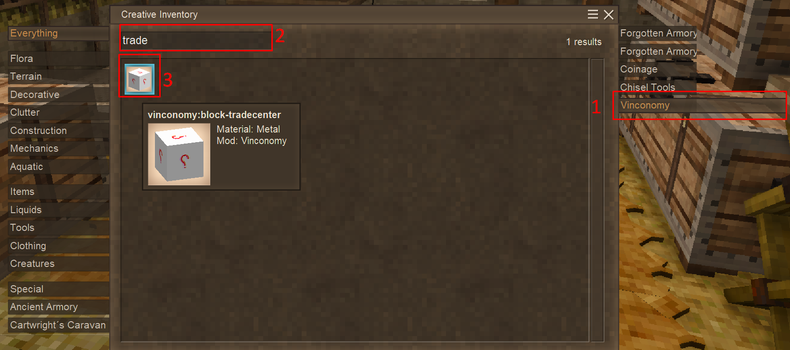
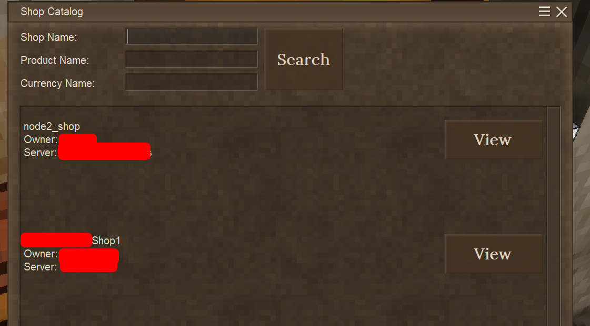
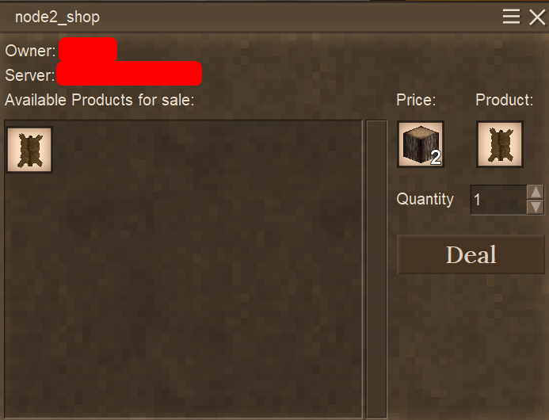

## Project Purpose
The Vinconomy-api is a server part of a Vinconomy mod.  
This specific part focuses around adding the ability of cross-server trading

### Prerequisites
- Personal computer (both Windows and Linux will work, and much more)
- Java environment (JDK 17)
- MySQL server
- Docker & Docker-Compose (optional, but this guide focuses on how to host with Docker)
- MySQL DB Client (optional, for changing network type or adding additional networks)

Steps below leave the installation of the individual components out of the scope of this guide.  
To see how to install each of them, refer to corresponding official documentation.  
Exception is MySQL server: if you're going with Docker setup, it will be deployed automatically.
Setting up a Vinconomy Shop is also out of the scope, refer to ModDB's [Vinconomy](https://mods.vintagestory.at/vinconomy) page

### Steps
1. [Deploying MySQL server](#deploying-mysql-server)
2. [Building the JAR](#building-the-jar)
3.

### Deploying MySQL server
Since building the JAR includes a test,which requires a DB connection, the first step should be to deploy the MySQL itself.
for that, make a copy of ```templates/custom_compose_run_mysql.sh``` (for Linux, or ```.ps1``` variant for Widnows),
and place it in the project root catalog. Adjust the variable values to the ones you want,   
**but at the very least change the password and root password**.  
Then run (for Linux, for Windows change ```./``` to ```.\``` and adjust extension to ```.ps1```; all further instructions are given for Linux and for Windows require identical substitution)
```shell
./custom_compose_run_mysql.sh
```
Once the MySQL image downloaded and container successfully deployed, you can proceed to building the JAR.
For troubleshooting, it's advised to use a commandline tool or a db client to check connectivity to configured port with specified user credentials

**Be aware** that after JAR is built, you'll need to kill the container for it to redeploy inside the new network, or configure the network preemptively.
Killing the container requires Ctrl+C from the shell where the container is running (stopping it), and then executing 
```shell
docker container rm vinconomy_db
```

### Building the JAR
if you have JDK 17 or higher by default, and you set up configuration variables in the application.properties, it should be enough to run 
```shell
./mvnw clean package
```
Otherwise, use a template ```templates/custom_mvn_pkg.sh``` in the similar fashion as in MySQL case and configure your parameters there.  
Execute it
```shell
./custom_mvn_pkg_ps.sh
```
Success will be indicated by a big font green text <span style="color:green">**BUILD SUCCESS**</span>  
If you get <span style="color:red">**BUILD FAILURE**</span>, that means your JAR artifact failed to build.
In that case, 2 most common errors are:
1. misconfigured database source: try to connect to the DB with the configured variables, but from some other client
2. java version. If you run multiple java environment, (and f.e. Minecraft required Java 8 by default, 16 in later versions), you will need to specify JDK of version 17 or higher

If you are sure **(and checked)** that both 1. and 2. are not the case, the next step would be to open an issue in GitHub.   
In that case please describe the issue, and provide the stacktrace.  
Describe the most context possible without disclosing sensitive information (database passwords/IPs can be considered such)

Once the JAR has been built, you should see a file ```vinconomy-0.0.1-SNAPSHOT.jar``` in the ```target``` catalog.

### Running the server

Similarly, repeat configuration from ```templates/custom_compose_run_both.sh```,
and then run it
```shell
custom_compose_run_both.sh
```
It should run successfully, but if for some reason server fails,
2 most common culprits would be:
- misconfiguration (please pay attention server should use internal MySQL port, which should be 3306 in the default configuration),  
- or JAR version mismatch (between generated JAR and Dockerfile) - this can be fixed by aligning the versions

### Connecting from the game

First of all, create a new world wit a possibility to enter a creative mode (core block has no recipe at the moment of writing).  
If using existing world, **make sure to back it up**

#### Place trading center
Inside the world, open console (clicking ```/```)
and type in ```/gm c``` to go into Creative mode
Inside Creative Inventory, open 'Vinconomy' tab
Then type 'trade' in the search window.
You should see a single block with Question Mark textures. select it and place into the world.
For more visual cues, refer to the screenshot


#### Configure the network parameters
In the console, type
```shell
/vincon network configure http://localhost:8081
```
If you have changed port, or run the server on external server, adjust IP & port accordingly
(external hosting may require firewall tinkering, but out of scope of this guide)

#### Join the network
Execute 2 commands one after another
```shell
/vincon network register
/vincon network join
```
If you have created a custom trading network inside DB (currently possible only from DB),
you should put the access key parameter for that network after ```join```

#### Sync up the shop contents
One you joined the network, and have any shop with any trade set up (tellers don't work),
you can wait a couple of minutes (~10), or run 
```shell
/vincon network sync
```
to upload the trades to the server. From my experience it's best to run this command a couple of times in 10-15 seconds intervals on the first setup.

#### Testing if it works
If you want to test if this works, you'll need to either try to do similar setup (skipping shop setup) on another PC (or ask your buddy),
or just do that in another world on the same machine (requires trade network type to be ASYNC for the latter one).

Once the network joined from another world, right-click the trade center block and click search button - It should display a number of shops available for this world (worlds cannot see inside-world shops in this menu)


Click view on the shop to see its goods availability. If you want to trade, click 'Summon trader'
A trader NPC will appear. Opening its trading menu will result in displaying the trades seen on the view menu.
Click on the trade you want to make, adjust Quantity and make a Deal
Keep in mind you need to have a Price in sufficient numbers in Inventory (even in Creative mode)


If you run ASYNC mode, trades will not be synced up instantly, and require some honor code. to force update, you can run sync command,
or to run trade network in SYNC mode

#### You have a working cross-server trading


ROADMAP/TODOS: 
1. document mechanics of each trade network type
2. add ability to manage networks from inside game client (? prob not high prio)
3. add updates running on stall window close on client - efficiency (maybe?) 


